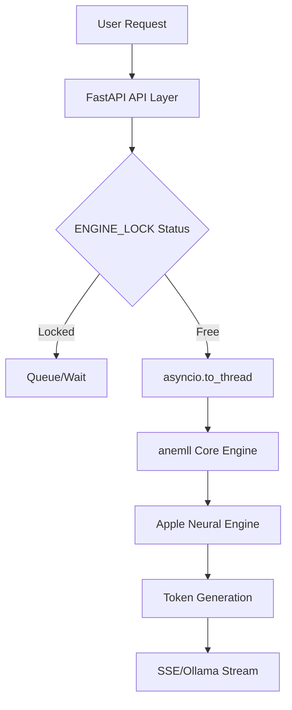

# 🧠 ANE Studio — Neural Engine AI for Mac

**ANE Studio** is an enterprise-grade, local-first AI experimentation platform optimized specifically for the **Apple Neural Engine (ANE)**. It provides a bridge between low-level Core ML inference and modern web-based/desktop AI interfaces.

---

## 🚀 Setup & Launch

### 1. Initialize Environment
Prepare the Apple Silicon environment and dependencies:
```bash
# This creates the virtual environment and installs CoreML/ANE tools
bash setup_coreml.sh
```
### 2. Launch ANE Studio
You have two ways to run the studio:

- **Option A: Native Mac Window (Recommended)**
  Runs the backend and opens a native macOS WebKit window.
  ```bash
  python ane_studio/app.py
  ```

- **Option B: Web Browser Mode**
  Starts the API server and opens the UI in your default browser.
  ```bash
  bash boot_api.sh
  ```

**Access URL:** `http://localhost:11436` (Web UI) / `http://[IP]:11436` (Network)

---

## 🏗️ Technical Architecture

ANE Studio is built on a modular monolith architecture that separates compute-heavy inference from high-concurrency API management.

### Threading & Safety Model
- **`ENGINE_LOCK`**: A global threading lock ensures that model loading and inference are sequential and safe for the ANE hardware.
- **Async Threading**: All blocking ANE calls are wrapped in `asyncio.to_thread` to prevent event-loop starvation in the FastAPI server.

### System Flow


---

## 🖥️ Mac Applications

The project features two distinct application layers:

### 1. ANE Studio App (`ane_studio/app.py`)
- **Type**: Native `pywebview` wrapper for the Studio UI.
- **Role**: Provides a focused, desktop-native experience for the studio's model hub and chat.
- **Backend**: Integrated FastAPI server running on port `11436`.

### 2. ANEMLLChat (`anemll/ANEMLLChat`)
- **Type**: Full native SwiftUI Application.
- **Stack**: Swift 6, SwiftUI, and direct `AnemllCore` integration.
- **Deployment**: Supports both **macOS (Sequoia)** and **iOS 18+**.
- **Features**: Real-time generation metrics, persistent storage for conversations, and on-device model management.

---

## 🎨 Design Philosophy: "Kinetically Premium"

The ANE Studio interface is designed to feel alive and high-end:
- **Glassmorphism**: High background blur (`20px`) and transparent layers for depth.
- **Typography**: Uses `Inter` for clarity and `JetBrains Mono` for code blocks.
- **Interactive States**: Pulse animations for active models and smooth Vue-based view transitions.

---

## 📝 Comprehensive Function Reference

### Server Logic (`ane_studio/server.py`)
- **`get_local_ip()`**: Dynamically detects the primary network IP for multi-device access.
- **`download_and_compile_model(model_id)`**: Handles background HuggingFace fetching and `coremltools` compilation.
- **`load_model_into_engine(model_id)`**: The primary hardware interface; loads `.mlpackage` components into the Neural Engine.
- **`generate_sse_stream(prompt)`**: Provides a `text/event-stream` for the Vue 3 chat interface.
- **`generate_ollama_stream(...)`**: Mimics the Ollama NDJSON format for third-party client compatibility.
- **`api_model_registry()`**: Manages the merge between local installed models and available remote models.
- **`get_installed_models()`**: Scans the filesystem for valid ANE model structures (`meta.yaml`).

### API Endpoints
- `GET /api/tags`: Ollama-compatible model listing (e.g., for Zed Editor).
- `POST /api/chat`: Unified streaming endpoint (SSE for UI, JSON for API).
- `GET /api/system/info`: Telemetry for RAM, Disk, and ANE status.

---

## 📁 Project Structure

```bash
.
├── ane_studio/          # 🏢 ANE Studio (API, UI, & Mac Launcher)
│   ├── app.py           # Native Mac Launcher
│   ├── server.py        # Core API & Inference Bridge
│   └── ui/              # Vue 3 Frontend
├── anemll/              # ⚙️ Core Engine & ANEMLLChat SwiftUI App
├── boot_api.sh          # ⚡ Browser Mode Startup (Port 11436)
├── setup_coreml.sh      # 🛠️ Initialization & Dependencies
└── .gitignore           # 📦 Resource protection
```

---

> **Current State:** Comprehensive Documentation | **Health:** Verified | **Inference:** Neural Engine (ANE)
